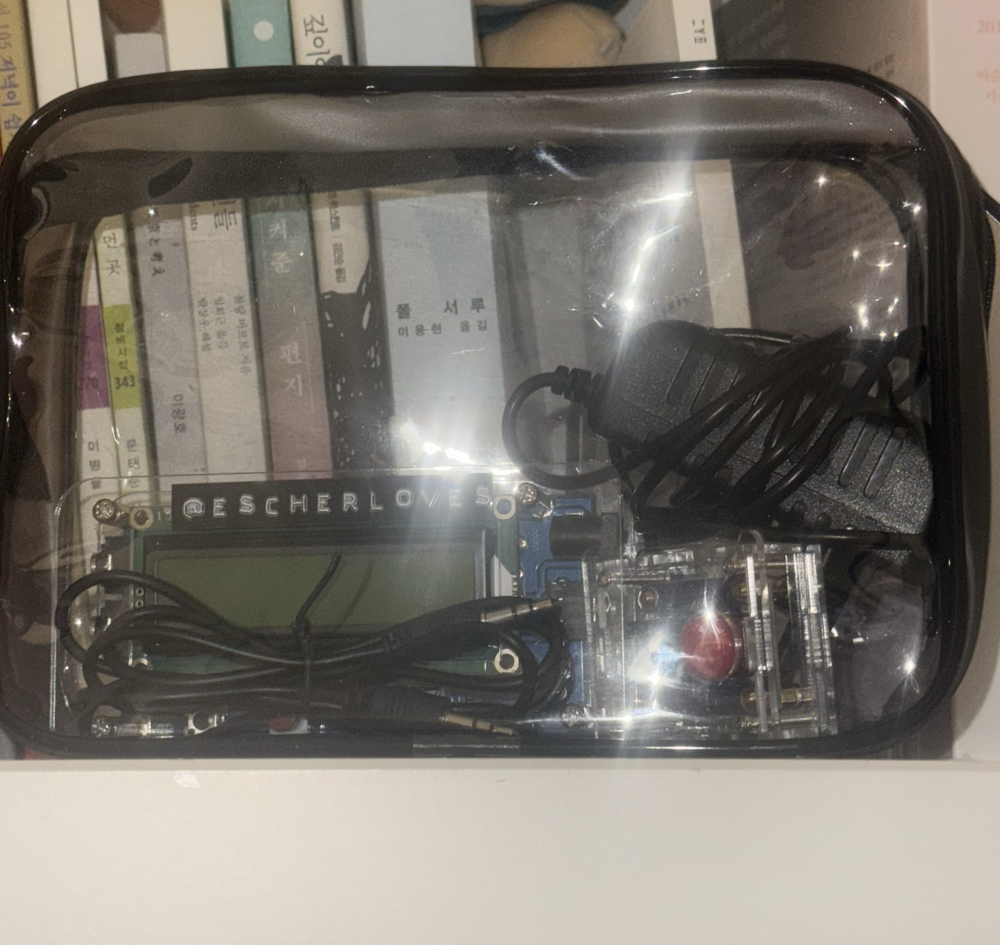
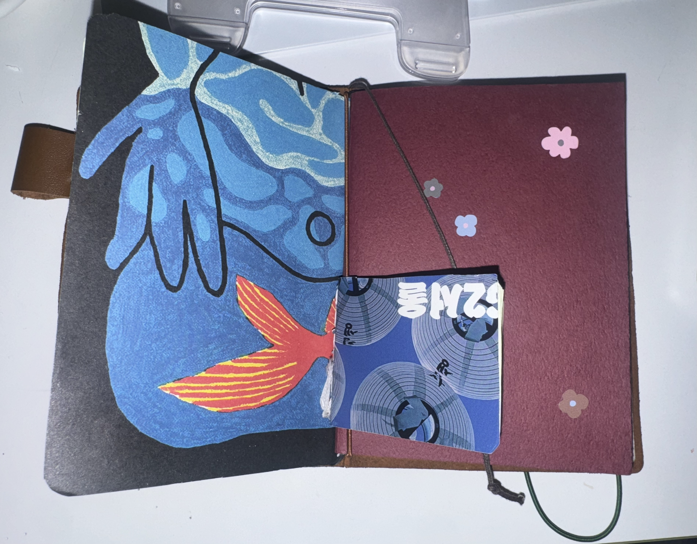

1. 모스부호 디코더 조립 (https://share.temu.com/U5yBP23NTHA)
예전부터 종종 HAM 영상을 봐 왔다. 아마추어무선사 이상의 무선국을 가지고 계신 분이겠지만, 아무튼 지구 거의 반대편 사람과 교신하며 자기 소개를 하고, 몇 마디 나누다 쿨하게 떠나는 사람들이 낭만적이라고 생각했다. 얼마나 멋진 대가 없는 우정인가! 국가와 등록번호 정도만 아는 서로의 행문을 빌어 주는 관게라니. 아무튼 간에 움.
테무에 뜬 모스부호 디코더가 오랜만에 그 감동을 끄집어 줬다. 무려 3년 만이다. 

부품 상태로 온 친구들을 일단 저항값에 맞게, 트랜지스터도 맞는 구멍에 끼워 주고 열심히 납땜을 했다. 중간에 음극을 반대로 끼운 바람에 전압을 주다 터뜨리기도 했다. 대충 아빠 회사 버려진 부품 창고에서 비슷한 놈으로 골라다 끼웠다. 아빠 고마워!
우여곡절 끝에 같이 완성한 디코더는 완벽히 작동했다. 밝기 조절 노브 때문에 애 먹은 것만 빼면...
급한 것만 끝나면 정말이지 3급이나 4급에 도전할 테다.

.-.. --- ...- . / ..- / .- .-.. .-.. -.-.--

이름표도 테무산 태그 메이커로 야무지게 붙여 주었다.

2. 노트 바인딩 키트 (https://share.temu.com/Rdg9sy1CFoA)
젤로 좋아하는 트래블러스 노트 속지가 떨어져 새로 샀던 참이었다. 종이의 질은 좋았지만 종이가 무겁고 두꺼워서 여러 개를 끼울 수가 없었다. (용도에 맞게 여러 권을 함께 쓰는 편) 테무에서 북 바인딩 키트를 팔길래 데려왔다. 왁스 실, 송곳, 구멍 뚫는 판자 요렇게 세 개가 들어 있었다. 

사촌 동생과 함께 내키는 대로 만들었다. 예에전에 좋아해서 자주 모았던 Don't Panic! 꾸러미와 써머 앨범 배경지로 스캔하려 구매했던 녹색 종이를 꺼내 썼다. 다~ 쓸 데가 있는 모양이다. 깔끔하진 않지만 마음에 든다. 남는 자투리 종이들로는 미니 노트도 만들었다. 트래블러스 노트가 참 좋은 점은 끈으로 바인딩을 한다는 것이다. 이런 미니 노트까지 품을 수 있는 트노의 한계는 대체...

3. 여행용품
한 달에 한 번씩 짐을 싸도 자꾸 좋은 템들이 보인다. 그래서 산 것들...
- 가방 열림 방지 클럽
- 접이식 여행용 옷걸이
- 미니 손톱깎이
- 미니 카메라 (단돈 8천원)
- 캐리어 바퀴 커버
- 미니 손전등

4. 기록용품
- 페이지 홀더: 일기 타이핑할 때, 책 필사할 때 최고다.
- NFC 스티커: 바로가기 숏컷 만들기 좋다.
- 접이식 가위

나머지 좌표 필요하면 뎀 주세용.