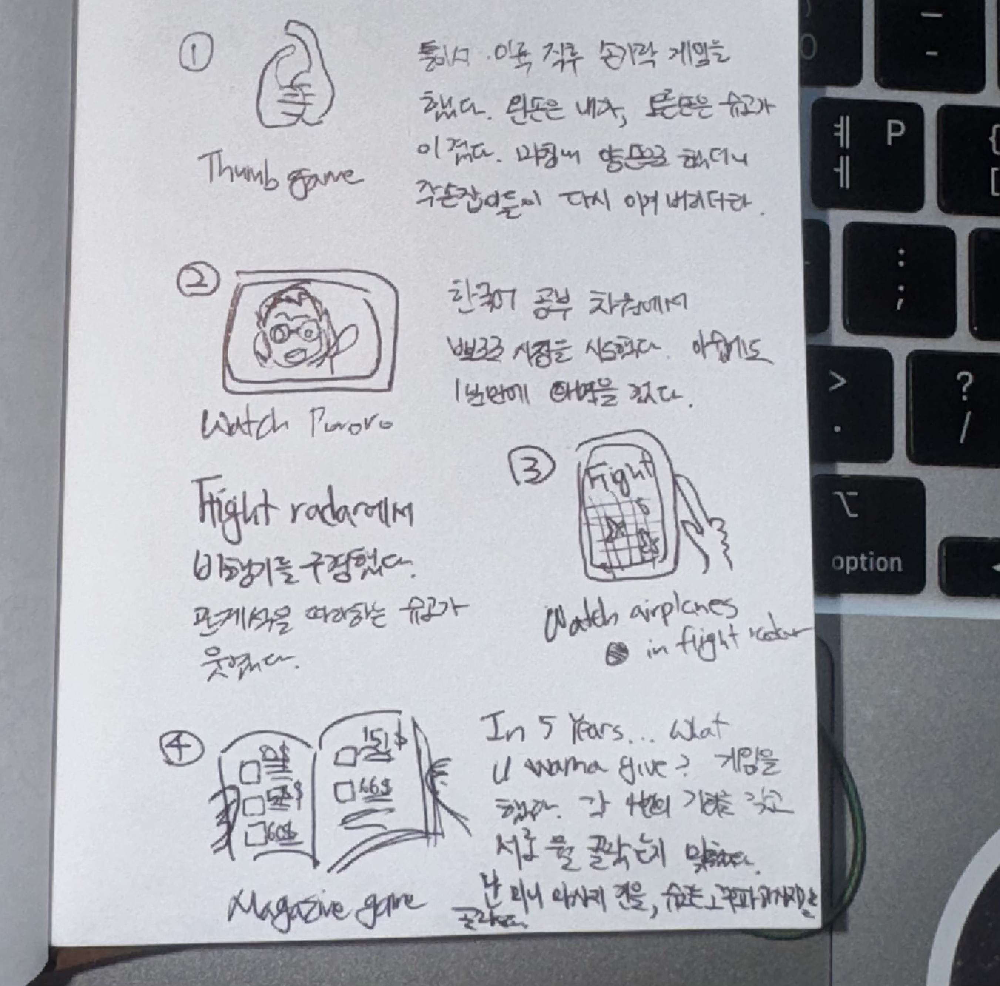

@KE1211
처음으로 슈고랑 같이 비행기를 타 봤다. 대략 2년 정도 붙어먹고 난 일이다.
우리의 여정은 버스타듯 자연스러웠고 늘 그랬던 것처럼 익숙했다.
창측 좌석에서 이륙하는 비행기들을 구경한다. 볼 일이 끝난듯 바로 책을 꺼내는 슈고를 보는 건 즐거운 일이다.

@남문지구대
슈고가 가방을 잃어버렸다. 여권이 있었기에 빠르게 항공사와 놓쳤을 것 같은 장소들에 전화를 돌렸다. 경찰서 방문에 실패하고 가까운 남문지구대로 향했다. 감사하게도 이곳 경찰 분들이 한둘 오셔서 절차에 대해 안내해 주셨고, 나는 빠르게 분실신고서를 작성했다. 다 작성하고 보니 슈고 앞으로 서에 있는 모든 경찰 분들이 오셔서 이곳저곳 이것저것 영어와 몸짓으로 물어봐 주시고 있었다. 몇 분 지나지 않아 한 경찰관 분께서 모니터를 앞에 두고 소리쳤다. "혹시 가방에 책, 쌍안경, 충전기 있어요? 있어요?" 약간 흥분한 어투와 상기된 얼굴로 우리를 쳐다보시는데, 난 심각했던 것도 잊어버리고 이상한 말투와 표정으로 대답해 버렸다. "맞아요!! 맞아요!!" 웃을랑 말랑, 어안이 벙벙한 이 상황을 내 얼굴이 표현하는 데 실패한 느낌이었다. 가방을 잃어버린 지 1시간 반 째 일어난 일이다.

몸짓 발짓으로 축하해 주시고, 수령처를 안내해 주시던 고마운 분들. 덕분에 제주 여행을 아름답게 남길 수 있게 되었다. 슈고의 그 많은 훈장과도 같은 도장들을 잃어버리게 하고 싶지 았았다.

+)  이번에 알게 된 사실 1 - 제주도에는 일본 대사관이 있다. 

@금오름
가깝길래 일몰 전 잠깐 들른 오름인데 생각보다 더 가파르고 더워 힘들었다. 뻐꾸기 울음을 배경음 삼아 걷던 인고의 시간이 지나고 올라가 해님을 보니 모든 피로가 다 가신 느낌이었다.
탁 트인 경치에 예쁘게 파인 웅덩이, 그리고 그 위를 받치고 있는 분홍빛 햇빛을 잊을 수 없을 것 같다.
조금 더 일찍 와서 한 시간 있다 갈 걸.

@바스코
서귀포에도 아지트가 생긴 것 같다.
멋진 사장님은 노래를 중구난방으로 드려도 멋지게 나열해서 틀어주신다.

@가파도
일어나서 가파도로 향했다. 바람을 가르며 탄 블루레이 3호는 우리를 즐겁게 하기 충분했다. 내려선 바로 자전거를 빌려갔는데, 한 바퀴 꼭꼭 씹어 도는데 대략 1시간 정도 걸린듯 하다. 조금 가면 화산석 가득한 선명한 해변이 조금 더 가면 둥근 돌멩이 해변이 펼쳐진다. 보는 재미가 있었다. 예쁜 소라를 주워다 주는 놈부터 조금 바보같던 제주 도요새까지 잊지 말자 친구야.
한 바퀴 다 돌고는 짬뽕을 먹으러 갔다. 내게 소라랑 해산물을 잘라 건네줬는데, 아무리 섬사람이어도 소라 똥이랑 살을 구분하지 못하는 게 도시 사람같고 웃겼다. 바위에 앉아 먹은 청보리 아이스크림은 그저 그랬다.
열심히 돌아다닌 탓인가 돌아오는 블루레이 1호에선 열심히 잤다.

@KE1174
비행기 안에서 적은 내용들. 바깥을 열심히 보고 있는 놈과 같이 Father & Son을 들었다.

