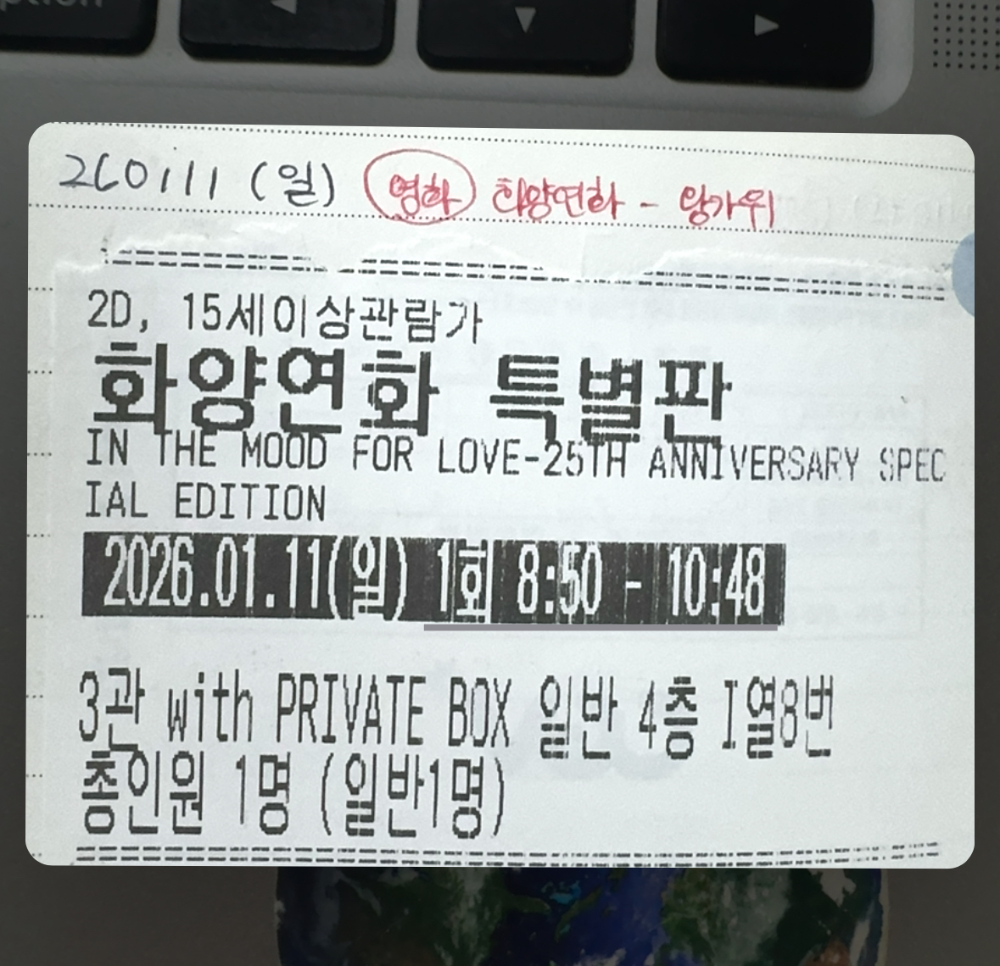

26.01.11 (일)

화양연화 - 왕가위

오랜만에 본 조조영화다. 약 5년 전 연혜 쌤 추천으로 중경삼림을 본 덕에 왕가위 감독 특유의 연출에 조금 익숙해질 수 있었다. 차우가 회사에서 무협소설을 쓰며 담배를 피던 장면이 자꾸 생각 난다. 뭉게뭉게 피어오른 연기들이 차우의 마음같아 보였다. 천장 등과 맞닿아 빙글빙글 도는 그 느낌이 좋았다.
좋아하는 일을 좋아하는 사람과 함께할 때의 부담감과 즐거움이란 참 사람을 몽롱하게 만든다고 생각한다.

영화를 보는 내내 홍콩의 시대상과 차우, 그리고 첸 부인의 관계성이 떠다녔다. 서로에 대한 마음이 커진 건 앞길을 점칠 수 없는 상황 탓이라고도 해볼 수 있으려나? 결혼 제도이 몰락과도 같은 상상 말이다. 불륜을 아름답게 느껴지게 했다는 점에서 금지된 사랑의 여러 방면을 와닿게 해준 영화다. 악역을 정하는 것도 어려울 지경이다.

불륜으로 인해 고통받는 배우자들, 새로운 사랑, 결국 서로 다른 현실을 받아들이고 되돌아가는 상황까지 참 이 애매한 감정선은 영화를 보는 내내 자꾸만 기분을 묘하게 했다. 이게 현실이겠지!

극 중 인물들의 호칭도 그러했다. 물론 직군과 시대상의 차이도 있었겠지만 모든 것을 내려놓은, 떠날 준비와 용기가 있었던 차우는 늘 차우라고 불린다. 첸 부인은 늘 '부인'이라는 호칭이 붙었고. 그래서 그런 것인지 다시 돌아갈 마음도 먹었다. 현실을 벗어날 용기가 더 필요했던 것이다. 주인 아주머니의 이야기에도, 자기 자신의 마음도 세차게 흔들려 현재를 바꾸지 못했다. 차우가 더 큰 확신을 주었다면 좀 달라졌을까?

"우리는 그들과 달라.", "결국 똑같았어요. 그래서 떠나는 거예요." 그리고 "나와 싱가폴에 가요.", "아직 배편이 남아 있다면 나도..." 이런 대사들은 미워하는 이들과 같아진 자신들의 싫지만서도 결국 다다르고 싶어하는 욕망을 잘 보여준다고 생각한다. 결국 삶에서의 중요한 선택들과 그 안에서 보존되는 기억들은 합리화와 개인의 해석을 전제로 하고 있는 것이라는 걸 또 다시 눌러 쓰게 됐다.

이번 리마스터링 버전에는 편의점 씬도 추가되었다. 1963년 캄보디아 엔딩 한참 이후인 2001년을 배경으로 했다고 한다. 이후의 두 남녀를 그려낸 것은 아니고 편의점에서 만난 또다른 남녀를 그리고 있다. 극 중 단골 여자가 술에 취해 자고 있을 때 시작한 그의 과감한 행동들을 시작으로 유사한 패턴들이 반복된다. 알고 있었음에도 계속 같은 상황을 만들어내며 받아주는 여자는 행동이 첸 부인과 겹쳐보였다.

어쩌면 그녀/그 중 한 명의 상상 속 평행세계는 아니었을까.

잠깐 찾아본 리뷰 중 하나는 이 씬과 영화 자체가 "사실이 아니라 전부 기억에 의존한 복기" 같다고 얘기했는데 이거 좀 재밌는 해석 같다.

아무튼 사회가 위태롭고, 내 가정도 불안한 상황에서 찾아온 위험한 인연과 끌림을 간접적으로 경험하게 해 준 영화 화양연화는 내게 다시금 삶에 진리와 정도는 없을 것이라는 것을 일깨워 줬다.

중경삼림 다시 봐야지!

+) 중간에 추가 씬 시작 전 자리를 떠난 내 앞 사람은 다 보고 가셨을까? 궁금하다. 제발 그랬으면 좋겠다.
